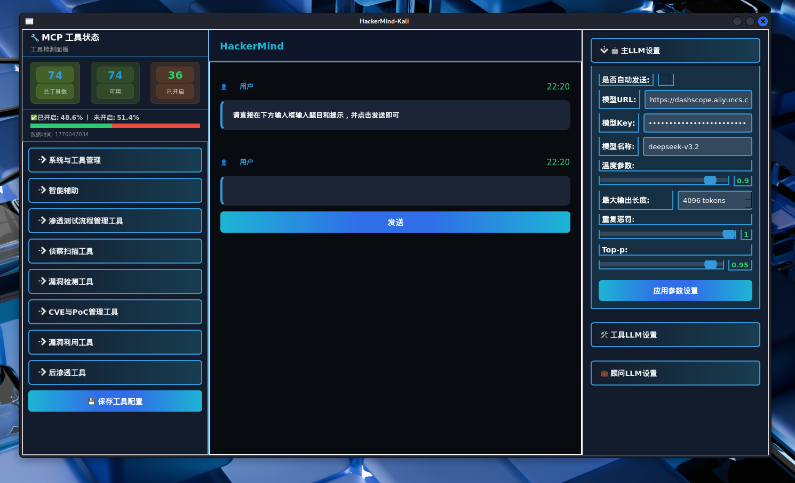
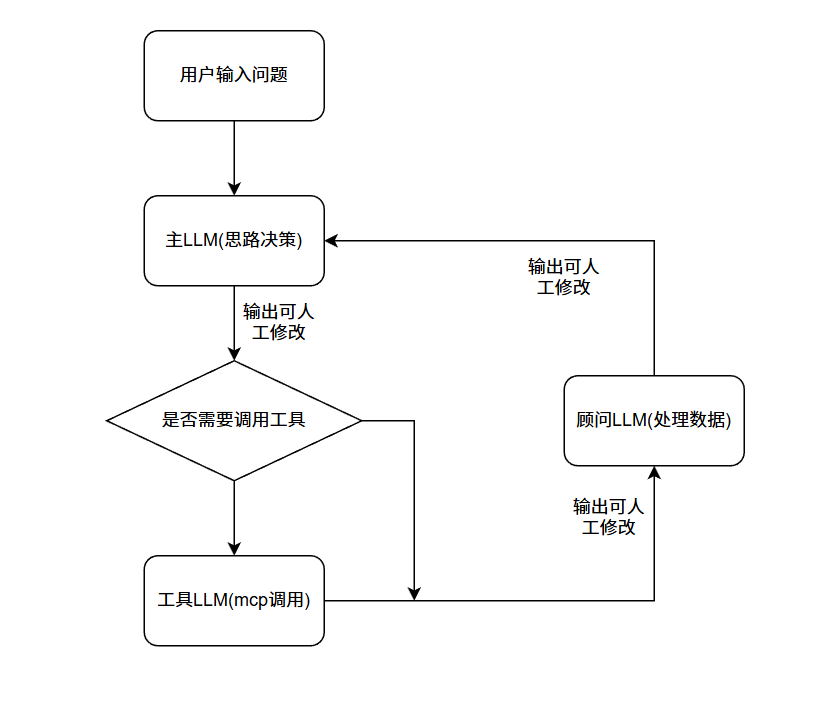
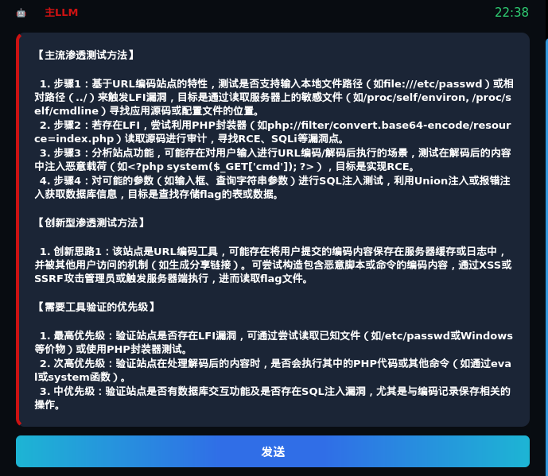

# HackerMind：三AI协同的网络安全智能分析系统

正在研发中...

## 项目简介
HackerMind 是一款面向网络安全领域的智能分析利器，创新性地采用**主LLM + 顾问LLM + 工具LLM** 三层AI协同架构，结合可修改式链上对话机制，有效减少AI幻觉问题，大幅提升网络安全分析、渗透测试等场景下的决策准确度。系统通过分层处理信息、人工实时干预AI信息链、高集成度工具调用三大核心特性，构建了更智能、更可控、更高效的网络安全分析能力。

## 核心架构：三AI协同机制
HackerMind 的核心优势在于独创的三AI分层协作模式，通过职责分离让不同AI各司其职，既发挥各自优势，又避免单一AI处理全量信息带来的效率低下和幻觉风险。

### 1. 工具LLM（Tool LLM）：专业工具调度与原始信息采集
工具LLM 是整个系统的“触手”，专注于**工具调用与原始数据获取**，不参与复杂决策：
- 核心职责：解析主LLM的指令，调度各类网络安全工具（如端口扫描、漏洞探测、资产测绘等），并获取原始工具输出数据；
- 差异化设计：减少传统“单次单一工具调用”模式，集成 `full_scan` 等高集成度MCP（模块化通信协议）能力，可一次性完成全维度扫描/探测，减少工具重复调用次数，提升兼容性与执行效率；
- 后续规划：将新增基础命令执行MCP、漏洞验证MCP、资产梳理MCP等更多高集成度工具模块，覆盖更全面的网络安全操作场景。

### 2. 顾问LLM（Advisor LLM）：信息提纯与专业分析
顾问LLM 是“信息过滤器”和“专业分析师”，承接工具LLM的原始数据，为主LLM减负：
- 核心职责：对工具LLM返回的原始信息进行清洗、筛选、结构化处理，提取高价值信息；基于网络安全专业知识，对处理后的信息进行初步分析，输出标准化分析结论；
- 关键价值：让主LLM无需直接处理杂乱的原始工具数据，避免因信息过载导致的思考冗余和幻觉产生，同时利用专业分析能力保证信息的准确性。

### 3. 主LLM（Main LLM）：全局决策与指令生成
主LLM 是整个系统的“大脑”，专注于**全局决策与指令下发**：
- 核心职责：接收用户需求，结合顾问LLM输出的结构化分析结论，生成精准的工具调用指令（下发给工具LLM），并最终向用户输出完整、可执行的分析报告/操作建议；
- 安全设计：主LLM不直接接触原始工具数据，仅处理顾问LLM提纯后的高价值信息，大幅降低决策偏差和幻觉概率。

## 核心特性
### 1. 链上对话：人工实时干预AI信息链
HackerMind 支持“可修改式回答”机制，人工可全程参与AI信息流转过程，实时修正方向：
- 干预节点：可修改工具LLM的扫描结果（如把手动的扫描信息添加上去，去引导ai往指定方向思考）、可修正顾问LLM的分析结论（如补充专业知识、纠正误判）、可调整主LLM的决策逻辑（如指定分析侧重点，并可指导期待调用什么类型的工具）；
- 干预方式：系统提供可视化界面，人工可通过界面直接修改AI的输出内容，作为下一个ai的输入，同时在此链式方式，无需额外添加用户的对话框。
- 价值：解决传统AI“黑盒决策”问题，让人工经验与AI能力深度结合，保证分析方向始终贴合实际需求。

### 2. 高集成度工具MCP：减少调用次数，提升兼容性
传统网络安全AI工具多为“单次调用单个工具”（如仅调用nmap做端口扫描），HackerMind 重构工具调用层：
- 集成化MCP：将分散的工具能力封装为高集成度MCP模块，例如 `full_scan` MCP可一次性完成“端口扫描 + 服务识别 + 漏洞探测 + 资产归类”全流程，替代多次单工具调用；
- 兼容性优化：统一MCP通信协议，适配主流网络安全工具（nmap、awvs、sqlmap等），避免因工具接口差异导致的调用失败；
- 效率提升：减少工具调用次数，降低网络开销和响应延迟，同时避免多次调用导致的信息碎片化。

### 3. 可视化参数配置：灵活调控AI行为
系统内置可视化参数配置面板，支持对主/工具/顾问LLM的核心参数独立调整：
- 可配置参数：模型URL/API Key/模型名称、温度、最大输出长度、重复惩罚、Top-p等；
- 实时生效：修改参数后点击“应用”即可实时更新AI配置，无需重启服务，适配不同场景的AI行为需求；
- 安全存储：所有配置参数加密存储于.env文件，API Key等敏感信息脱敏显示，保证数据安全。

## 后续规划
### 扩展MCP工具库
- 新增基础命令执行MCP：支持文件创建、命令执行等；
- 新增行业专属MCP：针对工控安全、云安全、移动安全等细分领域，开发专属高集成度MCP模块；
- ......

## 应用场景
- 渗透测试：自动化完成全流程渗透测试，人工实时修正测试方向，提升测试效率与覆盖率；
- 漏洞分析：批量分析漏洞数据，由顾问LLM验证漏洞真实性，主LLM输出修复建议；
- 资产梳理：通过full_scan MCP快速完成全网资产测绘，生成结构化资产清单；

## 总结
HackerMind 打破了传统网络安全AI工具“单一LLM全流程处理”的模式，通过三AI分层协同、链上人工干预、高集成度MCP三大核心设计，既解决了AI幻觉问题，又提升了工具调用效率和决策可控性。后续随着MCP工具库的扩展和多模态能力的加入，将进一步覆盖更多网络安全场景，成为网络安全从业者的智能协作利器。
