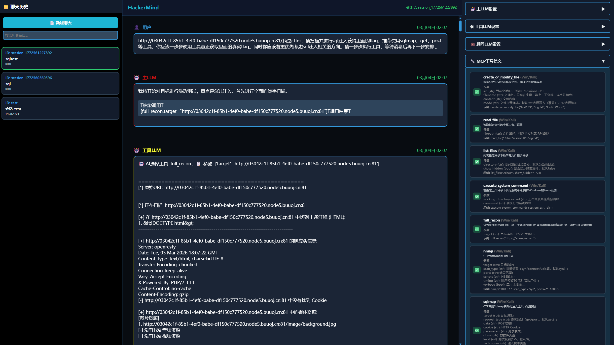
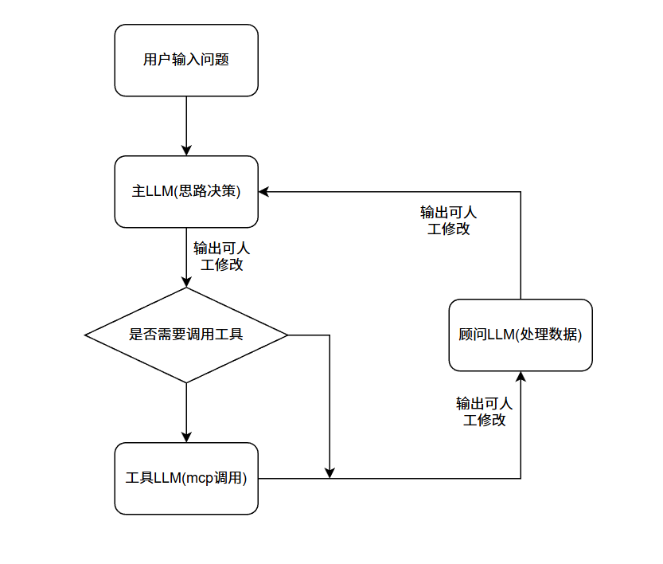
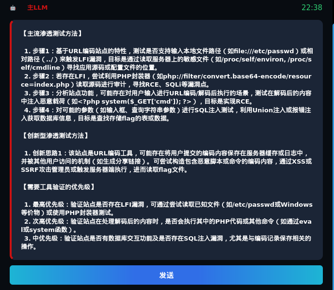

#  HackerMind【研发中...】

**三AI协同的网络安全智能分析系统**
*主LLM + 顾问LLM + 工具LLM三层架构，有效减少AI幻觉，提升决策准确度*

[核心架构](#-核心架构三ai协同机制) • [核心特性](#-核心特性) • [应用场景](#-应用场景) • [后续规划](#-后续规划)

---

## 📖 项目简介

HackerMind 是一款面向网络安全领域的智能分析利器，创新性地采用**主LLM + 顾问LLM + 工具LLM** 三层AI协同架构，结合可修改式链上对话机制，有效减少AI幻觉问题，大幅提升网络安全分析、渗透测试等场景下的决策准确度。

### 🚀 架构优势：HackerMind vs 传统AI安全工具

| 核心维度 | 🐢 传统AI工具 | ⚡ HackerMind | 📈 提升效果 |
| :--- | :--- | :--- | :--- |
| **AI架构** | 单一LLM全流程处理 | 三AI分层协作，职责分离 | 决策准确率提升 |
| **本地工具** | 一般完全依赖工具，无本地接口 | 能够创建文件执行命令，getpost请求 | 可执行面大大增加 |
| **工具调用** | 单次单一工具调用，效率低下 | 可以多工具一起执行 | 执行效率提升 |
| **人工干预** | ai输出无法修改 | 链上对话，人工可实时修改AI输出 | 可控性大幅提升 |

---

## 🧠 核心架构：三AI协同机制

### 1. 🛠️ 工具LLM（Tool LLM）：专业工具调度与原始信息采集
- **核心职责**：解析主LLM指令，调度网络安全工具，获取原始数据
- **技术特色**：集成`full_scan`等高集成度MCP，一次性完成全维度扫描
- **支持工具**：nmap、awvs、sqlmap等主流安全工具

| **MCP** | **主要功能** | **Windows** | **Kali** | **其他Linux** |
|------|------|----------|----------|
| **create_or_modify_file** | 创建和修改本地文件 | ✅ | ✅ | 需要手动安装 |
| **read_file** | 读取本地文件 | ✅ | ✅ | 需要手动安装 |
| **list_files** | 列出本地文件 | ✅ | ✅ | 需要手动安装 |
| **execute_system_command** | 本地命令执行 | ✅ | ✅ | 需要手动安装 |
| **post_request** | POST请求 | ✅ | ✅ | 需要手动安装 |
| **get_request** | GET请求 | ✅ | ✅ | 需要手动安装 |
| **get_knowledge_message** | 本地知识库请求 | ✅ | ✅ | 需要手动安装 |
| **execute_encoding_conversion** | 编码转化 || ✅ | ✅ | 需要手动安装 |
| **full_recon** | 全面的扫描侦查 | ✅ | ✅ | 需要手动安装 |
| **nmap** | 扫描工具 || ✅ | ✅ | 需要手动安装 |
| **sqlmap** | sql注入工具 | ✅ | ✅ | 需要手动安装 |
| **nikto** | 自动化扫描工具 | 需要手动安装 | ✅ | 需要手动安装 |
| **gobuster** | 目录枚举工具 | ✅ | ✅ | 需要手动安装 |

### 2. 🎯 顾问LLM（Advisor LLM）：信息提纯与专业分析
- **核心职责**：原始数据清洗、结构化处理、初步专业分析
- **价值体现**：为主LLM减负，避免信息过载导致的思考冗余

### 3. 🧠 主LLM（Main LLM）：全局决策与指令生成
- **核心职责**：接收用户需求，生成工具指令，输出分析报告
- **安全设计**：仅处理顾问LLM提纯后的高价值信息

---

## ⚡ 核心特性

### 1. 🔗 链上对话：人工实时干预AI信息链
- **干预节点**：可修改工具LLM扫描结果、修正顾问LLM分析结论、调整主LLM决策逻辑
- **干预方式**：可视化界面直接修改AI输出内容，无需额外对话框
- **核心价值**：解决传统AI"黑盒决策"问题，人工经验与AI能力深度结合

### 2. 🚀 高集成度工具MCP：减少调用次数，提升兼容性
- **集成化MCP**：`full_scan` MCP一次性完成端口扫描+服务识别+漏洞探测+资产归类
- **兼容性优化**：统一MCP通信协议，适配主流网络安全工具
- **效率提升**：减少工具调用次数，降低网络开销和响应延迟

### 3. ⚙️ 可视化参数配置：灵活调控AI行为
- **可配置参数**：模型URL/API Key、温度、最大输出长度、重复惩罚等
- **实时生效**：修改参数后点击"应用"即可实时更新
- **安全存储**：配置参数加密存储，敏感信息脱敏显示

---

## 🎯 应用场景

### 🔍 CTF渗透测试
- 自动化完成全流程渗透测试，人工实时修正测试方向
- 提升测试效率与覆盖率，减少人工重复劳动

### 🐛 漏洞分析
- 批量分析漏洞数据，工具LLM和顾问LLM验证漏洞真实性
- 主LLM输出针对性修复建议和风险评级

## CTF夺旗案例

---

## 🚀 后续规划

### 🔧 MCP工具库扩展
- **行业专属MCP**：工控安全、云安全、移动安全等细分领域
- **漏洞验证MCP**：专业化漏洞验证和利用链构建

### 🌐 多模态能力增强

---

## 📞 联系方式

如需获取完整版、技术支持或商务合作，请联系
* **QQ**: `2478511876`

---

Copyright © 2026 HackerMind Security Team. All Rights Reserved.

